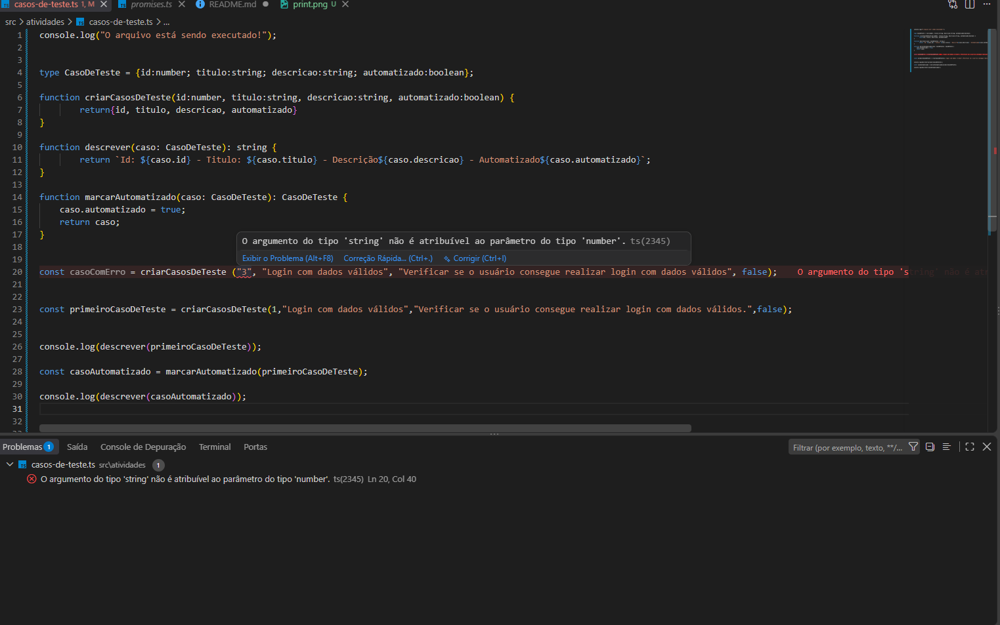

# Atividade - Casos de Teste

## O que foi feito

Foi criado o tipo `CasoDeTeste` com as propriedades:

- `id`: number
- `titulo`: string
- `descrição`: string
- `automatizado`: boolean

Também foram criadas as funções:

- `criarCasoDeTeste`: cria um novo caso de teste.
- `descrever`: retorna uma descrição do caso de teste.
- `marcarAutomatizado`: altera a propriedade `automatizado` para `true`.

## Como rodar

No terminal, dentro da pasta do projeto, execute:

```powershell
npx tsx src/atividades/casos-de-teste.ts

